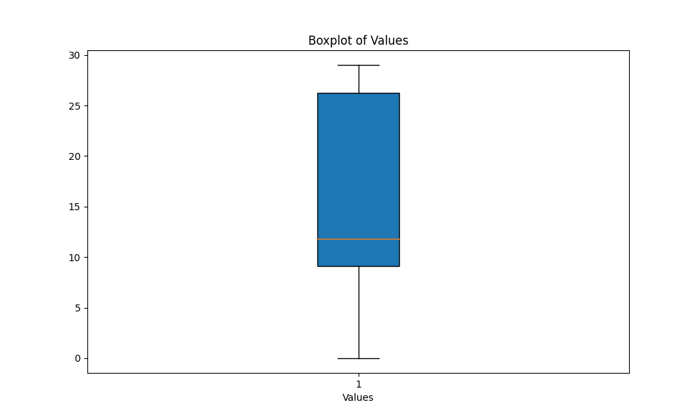
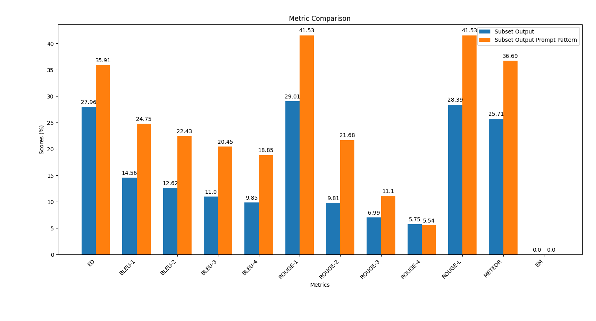

# Generative AI in Cybersecurity: Generating Offensive Code from Natural Language

This repository contains the materials and scripts for the talk titled **"Generative AI in Cybersecurity: Generating Offensive Code from Natural Language"** by Pietro Liguori, University of Naples Federico II, DESSERT group. The talk is part of **ARTISAN 2024: Summer School on the role and effects of ARTificial Intelligence in Secure ApplicatioNs**.

## Python Setup

Ensure you have Python installed on your system. If not, you can use a virtual environment with Anaconda to avoid working directly on your machine. Follow the steps below:

### Anaconda Installation

1. **Install Anaconda3**:
    - Ensure you have Anaconda3 installed. If not, you can download the installer from [here](https://repo.anaconda.com/archive).
    - Use the `wget` command to download the installer:
      ```bash
      wget https://repo.anaconda.com/archive/Anaconda3-2021.05-Linux-x86_64.sh
      ```
    - Make the installer executable:
      ```bash
      chmod +x Anaconda3-2021.05-Linux-x86_64.sh
      ```
    - Run the installer:
      ```bash
      bash Anaconda3-2021.05-Linux-x86_64.sh
      ```
    - You may need to add the Anaconda directory to the PATH environment variable. For example, add this line to your `bashrc` file:
      ```bash
      export PATH="/path_to_anaconda/anaconda3/bin:$PATH"
      ```

### Creating the Virtual Environment

2. **Create a Python 3.9 virtual environment**:
    - Create a virtual environment using the command:
      ```bash
      conda create -n yourenvname python=3.9
      ```
      Replace `yourenvname` with your desired environment name.

3. **Activate the environment**:
    - Activate the created environment with the command:
      ```bash
      source activate yourenvname
      ```

You are now ready to install dependencies and work within your virtual environment.


## Part 1: Automatic Code Generation and Evaluation

### Description

In the `Violent-Python-functions` folder, we have `.in` and `.out` files containing the NL (Natural Language) descriptions and the corresponding Python functions, respectively.

The [Violent Python](https://github.com/dessertlab/violent-python
) dataset is a manually curated dataset, where a sample contains a piece of Python code from an offensive software, and its corresponding description in natural language (plain English). We built the dataset using the popular book "Violent Python" by T.J. O'Connor, which presents several examples of offensive programs using the Python language. 

We have included only the function-level descriptions, totaling 72 pairs of NL descriptions - Python functions.

### Extracting a Subset

Now, we will extract a random subset of 10 samples from this dataset.

1. **Run the script**:
    - In the main directory, run the `create_subset.py` script with the following command:
      ```bash
      python create_subset.py
      ```

2. **Results**:
    - The script will create the `scripts/results` subfolder containing `reference.in` and `reference.out` files.
    - The `reference.in` file contains the 10 randomly extracted NL descriptions.
    - The `reference.out` file contains the corresponding 10 Python functions and serves as our ground truth for evaluation.

### Generating Outputs with AI Models

Next, you will generate 10 outputs using generative AI models like [ChatGPT](https://chat.openai.com/) or [Claude Sonnet](https://claude.ai/).

> [!CAUTION]
> Pay attention to the structure of the code snippets. As you can see, the Python codes are all *single-line*. In fact, multi-line instructions are separated from each other with `\n`.

3. **Generate Outputs**:
    - Use the NL descriptions stored in the `reference.in` file to generate the 10 outputs using the AI models.
    - Ensure the AI models generate the outputs line by line as required for the evaluation.
    - Save the model outputs in a file named `output.out` in the `results` folder.
    - Make sure the model has generated the code in single-line format 
    - Make sure you have a file with 10 lines (no empty lines at the end of the file).

    Example prompt:
    ```plaintext
    Generate Python 10 functions starting from the following 10 natural language (NL) descriptions:

    1. [NL description]
    2. [NL description]
    ...
    10. [NL description]

    Each function should be generated in a single line, for a total of 10 lines.
    Different instructions of the same function should be separated by the special character "\n".
    Do not use empty lines to separate functions.
    ```

4. **Install Dependencies**:
    - In the `scripts` folder, install the required dependencies using:
      ```bash
      pip install -r requirements.txt --user
      ```

5. **Calculate Similarity Metrics**:
    - In the `scripts` folder, run the python script `output_similarity_metrics.py` to calculate the output similarity metrics between the model predictions (`output.out`) and the ground truth reference (`reference.out`):
      ```bash
      python output_similarity_metrics.py hypothesis_file
      ```
      where `hypothesis_file` is the `results/reference.out` file.

The metrics will be generated in the `results/output_metrics.txt` file.

6. **Visualize Metric Variability**:
    - In the `scripts` folder, execute the script `boxplot_metrics.py` to visualize the variability of the metrics saved in the file `results/output_metrics.txt`:
      ```bash
      python boxplot_metrics.py
      ```

Below is an image showing the variability of the output similarity metrics with a boxplot:




## Part 2: Prompt Engineering

### Description

In this part, we will repeat the code generation process using the AI models, but this time applying a prompt engineering technique discussed during the talk. The goal is to observe if this technique improves the quality of the generated code.

### Steps

1. **Apply Prompt Engineering**:
    - Use the same NL descriptions stored in the `reference.in` file.
    - Modify your prompts according to the prompt engineering techniques learned during the talk.
  
    Examples of prompts can be found in the `prompt_examples` folder.

2. **Generate Outputs**:
    - Generate the 10 outputs using the AI models with the engineered prompts.
    - Save the model outputs in a file named `output_prompt_pattern.out` in the `scripts/results` folder, where `prompt_pattern` is an identifier you want to use to specify the adopted pattern (e.g., `output_persona.out`, `output_few_shot.out`).
    - Make sure (again) the model has generated the code in single-line format.
    - Make sure (again) you have a file with 10 lines (no empty lines at the end of the file).

3. **Calculate Similarity Metrics**:
    -  In the `scripts` folder, run the script to calculate the output similarity metrics between the model predictions (`output_prompt_pattern.out`) and the ground truth reference (`subset.out`):
      ```bash
      python output_similarity_metrics.py hypothesis_file
      ```
      where `hypothesis_file` is the file generated with the a prompt pattern (e.g., `results/output_few_shot.out` file).
    - The metrics will be generated in the `scripts/results/output_prompt_engineering_metrics.txt` file (e.g., `scripts/results/output_few_shot_metrics.txt` file). 

4. **Compare Results**:
    - In the `scripts` folder, execute the script `plot_metrics_comparison.py` to compare the results:
      ```bash
      python plot_metrics_comparison.py file2
      ```
      where `file2` is `scripts/results/output_prompt_engineering_metrics.txt` file.
    - The script will create bar charts to visualize the differences between the metrics of the different outputs.

Below is an image showing the comparison of metrics between the outputs generated without prompt engineering and with few-shot prompt engineering:



Follow these steps to apply prompt engineering and evaluate its impact on the code generation quality.

## Saved Outputs

In the `saved_outputs` folder, you will find examples generated with ChatGPT-4. These examples illustrate how the model's outputs look like with different prompt engineering techniques applied.

## Credits

This repository and the materials were developed by:

- Alessio Foggia (alessio.foggia@unina.it)
- Cristina Improta (cristina.improta@unina.it)
- Pietro Liguori (pietro.liguori@unina.it)
